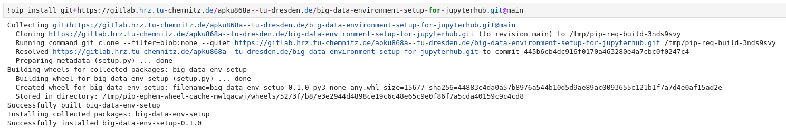
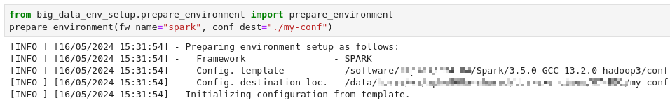
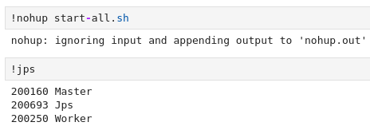

# Big Data Environment Setup for Jupyterhub

## Description
This project provides a simple Python module containing tools to setup environment for big data frameworks to be used in [Jupyterhub services](https://compendium.hpc.tu-dresden.de/access/jupyterhub/?h=jupyter) of [ZIH HPC System](https://tu-dresden.de/zih/hochleistungsrechnen/hpc).

## Installation
You can install the module using pip inside jupyter hub cell:

```sh
pip install git+https://gitlab.hrz.tu-chemnitz.de/apku868a--tu-dresden.de/jupyter-python-kernel.git
```
Output can be as follows:


## Getting started

Here's an example of how to use the module inside jupyter notebook:
```python
from big_data_env_setup.prepare_environment import prepare_environment

# Using default:
#   - configuration template
#   - configuration initialization destination
prepare_environment(fw_name="spark")

# Using default:
#   - configuration template
prepare_environment(fw_name="spark", conf_dest="./conf")

# Using default:
#   - configuration initialization destination
prepare_environment(fw_name="spark", conf_template="/path/to/template")

# If all fields are used
prepare_environment(fw_name="spark", conf_dest="./conf", conf_template="/path/to/template")
```
Output is as follows for one of the use case:


Once the environment is setup and configuration is initialized, big data cluster can be started. For spark it can be done in jupyter notebook as shown below:


After starting the cluster, one can proceed with the work in subsequent cells.

## License
This project is licensed under the GNU GENERAL PUBLIC LICENSE - see the [LICENSE](./LICENSE) file for details.

## Contact
For more information contact us at [ScaDS.AI](https://scads.ai/scads-ai-team/contact/).