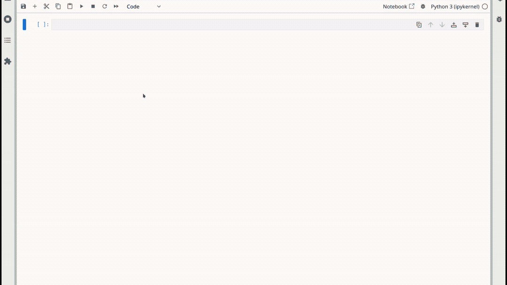

<div style="display: flex; flex-direction:column; justify-content: center; width:100%;margin: 0px auto;">
    <div style="font-size:30px;font-weight:bold;margin: 0px auto;"> BiJuTy </div>
    <div style="margin: 0px auto; max-width:400px; display: flex;text-align: center">
        An Interactive HPC-Aware Big Data Cluster Lifecycle Manager and Performance Assessment Utility for JupyterHub
    </div>
</div>


## About

BiJuTy (pronounced BYOO-tee) is an interactive Jupyter Notebook-based framework that simplifies cluster lifecycle management and performance assessment on HPC systems for users of all experience levels. It enables seamless multi-cluster management, automates performance metric collection, and allows users to iteratively optimize big data applications in just a few clicks.

<div align="center">
  
</div>

## Getting Started

Install the package directly from GitHub inside a Jupyter notebook cell:

```python
!pip install git+https://github.com/apurvkulkarni7/bijuty.git
```

Or install from a local clone:

```bash
git clone https://github.com/apurvkulkarni7/bijuty.git
cd bijuty
pip install -e .
```

To get started, simply import the package in a notebook cell:

```python
import bijuty
```

## Requirements

BiJuTy supports the following packages:

| Package | Version |
|---------|---------|
| **Python** | 3.11 |
| **Apache Spark** and **PySpark**| 3.5.0 |
| **Apache Flink** | 1.14.1 |

Additional requirements:
- A JupyterHub / Jupyter Notebook environment
- `ipywidgets` enabled in Jupyter
- An active SLURM job allocation (the tool auto-detects SLURM resources)

### Enabling Jupyter Widgets

If `ipywidgets` is not already enabled, run once in a terminal:

```bash
jupyter nbextension enable --py widgetsnbextension
# For JupyterLab:
jupyter labextension install @jupyter-widgets/jupyterlab-manager
```

## Interface Sections

The BiJuTy provides an interactive interface with the following sections:

### Configuration Panel

| Control | Purpose |
|---------|---------|
| **Framework** | Select Spark or Flink |
| **Custom FRAMEWORK_HOME** | Optionally override the framework installation path |
| **Template** | Use the default config template or specify a custom one |
| **Destination** | Directory where the generated configuration will be written |
| **Master Host** | The node to use as the cluster master |
| **Worker Hosts** | Nodes to use as workers (checkboxes auto-populated from SLURM) |
| **Driver / Worker / Executor CPU** | CPU allocation sliders |
| **Driver / Worker / Executor Memory** | Memory allocation sliders (MB) |
| **Randomize Master Port** | Avoid port conflicts when many users share nodes |
| **Load to Environment** | Generate configuration and update environment variables |

### Resource Allocation Overview

A live visualization shows how CPU and memory resources are distributed across master, worker, and executor roles based on the SLURM allocation.

### Cluster Controls

After loading the environment:
- **Start Cluster** - starts the selected framework cluster
- **Stop Cluster** - gracefully stops the cluster
- **Web UI Links** - buttons to open framework web UIs (Spark Master, Worker, Application UI; Flink JobManager UI)

> SSH Port Forwarding: If running on the HPC cluster, the GUI displays an SSH command to forward web UI ports to your local machine so you can access cluster and application GUI.

### Performance Metrics

Real-time monitoring interface that aggregates metrics across multiple levels:

| Level | Description |
|-------|-------------|
| **Process Level** | Per-process CPU utilization, memory consumption, and I/O statistics for running cluster components |
| **Framework Level** | Framework-specific metrics such as Spark executor metrics, task throughput, or Flink job statistics |
| **External Metrics** | Integration with external monitoring sources (e.g., Pika metrics server) for extended cluster-wide observability |


### Multi-Cluster Management

Add new cluster tabs with **+** and remove them with **x** to manage multiple independent framework clusters via a tabbed interface.

## License

This project is licensed under the GNU General Public License v3.0 (GPL-3.0-or-later) - see the [LICENSE](./LICENSE) file for details.

## Acknowledgements

This work was developed at [ScaDS.AI](https://scads.ai/) (Center for Scalable Data Analytics and Artificial Intelligence).
