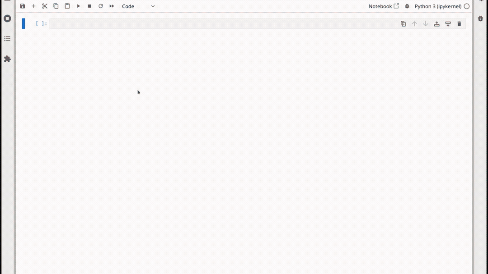

<div align="center">
  <h1>BiJuTy</h1>
  <p>An Interactive HPC-Aware Big Data Cluster Lifecycle Manager and Performance Assessment Utility for JupyterHub</p>
</div>

<div align="center">
  
</div>

## About

BiJuTy (pronounced BYOO-tee) is an interactive Jupyter Notebook framework for managing big data clusters and assessing their performance on HPC systems. It provides multi-cluster management, automated metric collection, and point-and-click optimization of Apache Spark and Apache Flink applications.

## Getting Started

Install from PyPI:

```bash
pip install bijuty
```

Or install from GitHub / a local clone:

```bash
pip install https://github.com/ScaDS/bijuty/archive/refs/heads/main.zip

# or
git clone https://github.com/ScaDS/bijuty.git
cd bijuty
pip install -e .
```

Then launch the interface by importing the package in a notebook cell:

```python
import bijuty
```

## Requirements

| Component | Version |
|-----------|---------|
| **Python** | 3.12.3 |
| **Apache Spark / PySpark** | 4.1.3 |
| **Apache Flink / PyFlink** | 2.2.1 |

The Python dependencies (`ipywidgets`, `anywidget`, `plotly`, `psutil`, `requests`) are installed automatically.

Additional requirements:

- **A Jupyter environment** (JupyterHub / JupyterLab / Notebook) with `ipywidgets` enabled.
- **SLURM** for HPC deployments. An active allocation is auto-detected and its resources are used as defaults. Without SLURM, BiJuTy falls back to a local-machine mode using the host's CPU and memory — useful for development and testing.
- **An existing framework installation.** BiJuTy launches Spark or Flink from a pre-installed copy; it does not install the frameworks for you. Provide the installation in one of the following ways:
  - **Environment module** (recommended on HPC): `module load spark` or `module load flink`.
  - **Custom path**: tick **Use custom `SPARK_HOME` / `FLINK_HOME`** in the Configuration Panel and enter the installation directory.
  - **Environment variable**: export `SPARK_HOME` or `FLINK_HOME` before starting the notebook.
- **A Java runtime (17 or 21 recommended).** Apache Spark 4 requires Java 17+, and Apache Flink 2 requires Java 11+. A valid `JAVA_HOME` is passed through to the cluster configuration.

### Enabling Jupyter Widgets

If `ipywidgets` is not already enabled, run once in a terminal:

```bash
jupyter nbextension enable --py widgetsnbextension
# For JupyterLab:
jupyter labextension install @jupyter-widgets/jupyterlab-manager
```

## Interface Sections

### Configuration Panel

| Control | Purpose |
|---------|---------|
| **Framework** | Select Spark or Flink |
| **Logo** | Framework logo indicator (updates with the selected framework) |
| **Use custom `SPARK_HOME` / `FLINK_HOME`** | Optionally override the framework installation path |
| **Template** | Use the default config template or specify a custom one |
| **Destination** | Directory where the generated configuration is written |
| **Master Host** | Node to use as the cluster master |
| **Worker Hosts** | Nodes to use as workers (checkboxes auto-populated from SLURM) |
| **Coordinator Cores / Memory** | Resources for the master/coordinator process (Spark driver, Flink JobManager) |
| **Cores / Memory Pool per Node** | Total compute pool assigned to each worker node (Spark worker, Flink TaskManager) |
| **Cores / Memory per Compute Unit** | Resources for each individual executor / task slot (Spark executor, Flink slot) |
| **Randomize Master Port** | Avoid port conflicts when many users share nodes |

The CPU and memory sliders are dynamically constrained by the SLURM allocation and by each other, so the available ranges always stay valid (e.g. the compute-unit range is capped by the per-node pool, which is in turn capped by the remaining node capacity).

### Custom Configuration Templates

The **Template** control lets you point BiJuTy at your own framework configuration
directory instead of the bundled default. When a template is used, its entire
directory is copied to the **Destination** and then BiJuTy fills in the
configuration.

How the GUI and a custom template interact:

- **Placeholders are substituted; hardcoded values are kept.** The bundled
  templates use UPPER_CASE placeholder tokens — Spark uses `FRAMEWORK_*`
  (e.g. `FRAMEWORK_PARALLELISM`, `FRAMEWORK_MEM_MASTER`) and Flink uses `FLINK_*`
  (e.g. `FLINK_PARALLELISM`, `FLINK_SLOTS_PER_TASKMANAGER`, `FLINK_MEM_*`). BiJuTy
  replaces these tokens with the values from the Configuration Panel sliders. Any
  hardcoded value in your template (e.g. `parallelism.default: 8` or
  `numberOfTaskSlots: 4`) is left untouched, because substitution is a literal
  token replacement — if the token is absent, nothing changes.
- **The GUI does not read the template back.** The sliders are not populated from
  the template; they always start from BiJuTy's defaults and are only constrained
  by the SLURM allocation. Selecting a template does not move any slider to match
  the template's values.
- **A placeholder token is the only way a slider value reaches the config.** Keep
  the token in a line to let the GUI drive that setting; remove it (and hardcode
  the value) to keep full manual control.
- **Some files are always regenerated.** The worker list (`workers`) is always
  rewritten from the **Worker Hosts** checkboxes, regardless of the template.

This means a fully hand-tuned configuration is possible: use a custom template
with hardcoded values and omit the corresponding placeholder tokens.

#### Creating a template from the factory default

Use `bijuty.init_template` (or the `bijuty-template` command) to copy the bundled
factory template into an editable directory:

```python
import bijuty

path = bijuty.init_template("flink", "./my-flink-template")
print(path)
```

```bash
# equivalent command-line form
bijuty-template flink --destination ./my-flink-template
```

Edit the files in that directory — add options, change resources, hardcode values,
or remove placeholder tokens you do not want the GUI to fill in — then start the
cluster from the GUI:

1. Under **Template**, clear **Use default template**.
2. Enter the path returned by `init_template`.
3. Press **Start Cluster**.

Use `bijuty.available_templates()` to list the frameworks with a factory template,
and `bijuty.factory_template_path("spark")` to locate the bundled one without
copying it. Pass `overwrite=True` (CLI: `--overwrite`) to merge into an existing
directory instead of raising.

### Resource Allocation Overview

A live visualization shows how CPU and memory are distributed across master, worker, and compute-unit roles based on the SLURM allocation.

### Cluster Controls

The **Cluster Management** section shows live cluster status (Running / Stopped), the active master node and port, and the configured workers, together with ready-to-use connection snippets for your notebook (e.g. `spark://<master>:<port>` for Spark, or a PyFlink `Configuration` snippet pointing at the remote JobManager for Flink).

- **Start Cluster** — generates the framework configuration, updates the environment variables, and starts the selected framework cluster.
- **Stop Cluster** — gracefully stops the cluster, falling back to automatic process cleanup if the graceful shutdown times out.
- **Web UI Links** — buttons to open the framework web UIs (Spark Master, Worker, and Application UI; Flink JobManager UI).

Whenever the framework or its configuration parameters change, the environment is regenerated automatically on the next **Start Cluster**.

> **SSH port forwarding:** On the HPC cluster, the GUI displays an `ssh` command to forward the web UI ports to your local machine.

### Performance Metrics

Real-time monitoring across multiple levels. Each monitor is an interactive Plotly dashboard with per-metric toggles, start/stop controls, and an adjustable refresh interval.

| Level | Description |
|-------|-------------|
| **Process Level** | Per-process CPU utilization, memory (RSS / virtual), thread count, and I/O read/write statistics for every running cluster component (master, workers, executors / task managers) |
| **Framework Level** | Framework metrics fetched from the REST API: Spark application metrics (jobs, stages, tasks, executors, memory, shuffle I/O, GC time) via port 4040, or Flink cluster/job metrics (jobs, tasks, slots, task managers, memory) via port 8081 |
| **External Metrics** | Integration with the Pika job timeline metrics server for cluster-wide observability — parallel-filesystem I/O (Lustre, etc.), CPU, memory, FLOPS, IPC, InfiniBand/Ethernet bandwidth, and GPU metrics |

> **Pika setup:** configure the server URL and API key in the External Metrics panel (the **Get API Key** button opens the Pika authentication page) or provide them via the `PIKA_BASE_URL` and `PIKA_TOKEN` environment variables. Metrics are selected from a searchable list and plotted on a shared timeline.

### Multi-Cluster Management

Add cluster tabs with **+** and remove them with **x** to manage multiple independent framework clusters through a tabbed interface.

## Roadmap / TODO

- [ ] **Make the Configuration Panel updatable from the selected template.** When
  a custom (or default) template is loaded, parse its values and initialize the
  sliders and their ranges (parallelism, slots per TaskManager, master/worker
  memory, and the other resource settings) so the GUI matches the template,
  instead of always starting from BiJuTy's built-in defaults. This would keep the
  GUI and the generated configuration in sync in both directions.
- [ ] **Add a "create editable copy" action to the Configuration Panel.** Wire the
  `bijuty.init_template` helper (and the `bijuty-template` command) into the GUI
  with a button next to the **Template** field, so a user can stamp out an
  editable copy of the factory default and have the path filled in automatically
  instead of running Python or the CLI by hand.
- [ ] **Validate custom templates before starting.** Check that a user-supplied
  template directory contains the required files (`meta.conf`, `cmd.sh`, and the
  framework config file) and surface a clear message in the GUI, rather than
  failing later inside `framework-configure.sh`.
- [ ] **Unify template placeholder handling across frameworks.** Spark templates
  use `FRAMEWORK_*` tokens substituted by `framework-configure.sh`, while Flink
  uses `FLINK_*` tokens substituted in Python; document the exact placeholder set
  each framework supports and, where possible, converge on one convention.

## License

This project is licensed under the GNU General Public License v3.0 (GPL-3.0-or-later) — see the [LICENSE](./LICENSE) file for details.

## Acknowledgements

This work was developed at [ScaDS.AI](https://scads.ai/) (Center for Scalable Data Analytics and Artificial Intelligence).

## Citing BiJuTy

If you use BiJuTy in your research, please cite it as:

> Apurv Deepak Kulkarni, Jan Frenzel, and Siavash Ghiasvand. *BiJuTy: An Interactive HPC-Aware Big Data Cluster Lifecycle Manager and Performance Assessment Utility for JupyterHub.* In Proceedings of the HiPES Workshop, Euro-Par 2026. arXiv:2606.24412 [cs.DC], 2026. https://arxiv.org/abs/2606.24412

```bibtex
@inproceedings{kulkarni2026bijuty,
  title        = {{BiJuTy}: An Interactive {HPC}-Aware Big Data Cluster Lifecycle Manager and Performance Assessment Utility for {JupyterHub}},
  author       = {Kulkarni, Apurv Deepak and Frenzel, Jan and Ghiasvand, Siavash},
  booktitle    = {Proceedings of the HiPES Workshop},
  venue        = {Euro-Par 2026},
  year         = {2026},
  eprint       = {2606.24412},
  archiveprefix = {arXiv},
  primaryclass = {cs.DC},
  url          = {https://arxiv.org/abs/2606.24412}
}
```
